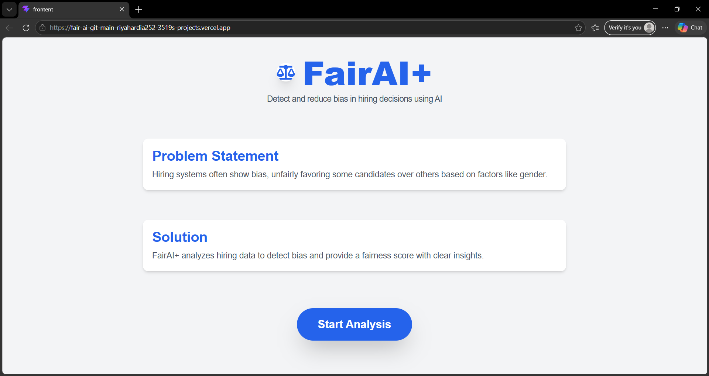
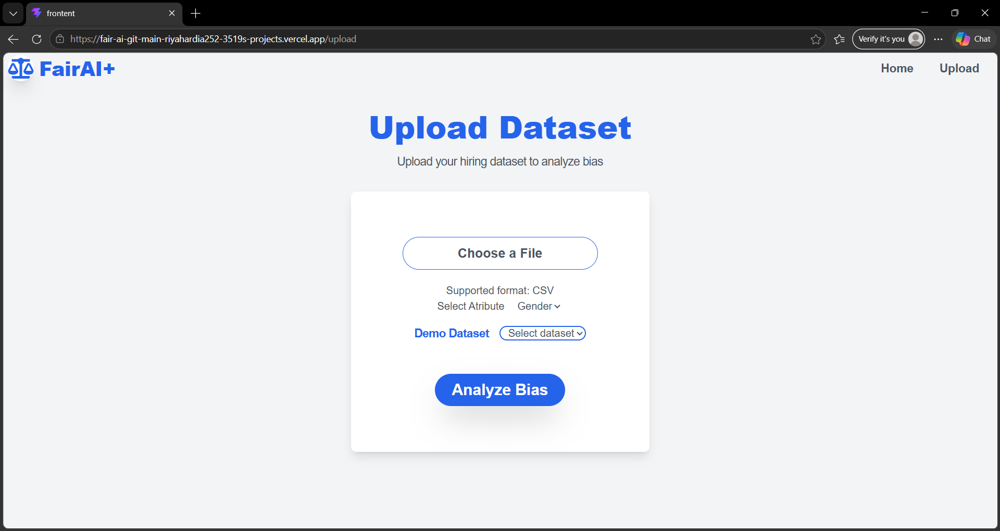
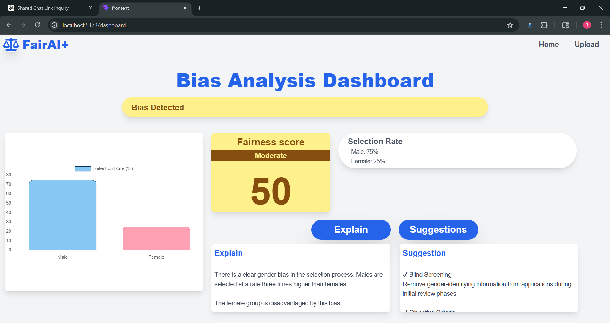

# 🤝 FairAI+ Frontend

> **Detect bias in datasets. Analyze fairness in AI systems.**  
> 🚀 Built for Hackathon: Focused on fairness, transparency, and explainable AI.

A modern React-based frontend for analyzing gender bias in hiring decisions using AI-powered insights.


---

## ✨ Features

### 📤 Dataset Upload
- **CSV Upload**: Seamlessly upload hiring datasets
- **File Validation**: Automatic format checking
- **Real-time Preview**: See your data before analysis

### 🎨 Demo Datasets
- **No Bias Dataset**: Perfectly fair hiring decisions
- **Moderate Bias Dataset**: Slight gender disparities
- **High Bias Dataset**: Significant bias patterns
- **Instant Testing**: Test the app without uploading files

### 📊 Fairness Analysis
- **Fairness Score**: 0–100 scale with color coding
  - 🟢 **Green (80–100)**: Fair hiring process
  - 🟡 **Yellow (50–79)**: Moderate bias detected
  - 🔴 **Red (0–49)**: Significant bias present
- **Gender-based Statistics**: Male vs. Female selection rates
- **Interactive Bar Charts**: Animated visualization with Chart.js

### 🤖 AI-Powered Insights
- **Bias Explanations**: AI-generated analysis of detected bias
- **Smart Suggestions**: Actionable recommendations to improve fairness
- **Powered by Gemini**: Leverages Google's generative AI

### 📱 Responsive Design
- **Mobile-First**: Works on all devices (mobile, tablet, desktop)
- **Clean UI**: Modern interface with Tailwind CSS
- **Accessible**: User-friendly navigation and interaction

---

## 🛠 Tech Stack

| Technology | Purpose |
|-----------|---------|
| **React 19** | UI framework & components |
| **Vite** | Fast bundler & dev server |
| **Tailwind CSS** | Styling & responsive design |
| **React Router** | Client-side navigation |
| **Chart.js** | Data visualization |
| **React Icons** | UI icons |
| **Fetch API** | Backend communication |

---

## 📁 Folder Structure

```
frontend/
├── src/
│   ├── pages/
│   │   ├── Home.jsx        # Landing page
│   │   ├── Upload.jsx      # CSV upload interface
│   │   └── Dashboard.jsx   # Results & analysis
│   ├── components/
│   │   ├── Nav.jsx         # Navigation bar
│   │   ├── UploadForm.jsx  # File upload form
│   │   ├── PreviewPanel.jsx # Data preview
│   │   ├── BarChart.jsx    # Chart visualization
│   │   └── Loading.jsx     # Loading spinner
│   ├── data/
│   │   └── demoData.js     # Sample datasets
│   ├── App.jsx             # Root component
│   ├── main.jsx            # Entry point
│   └── index.css           # Global styles
├── public/                 # Static assets
├── package.json
├── vite.config.js
├── tailwind.config.js
└── README.md               # This file
```

---

## ⚡ Installation & Setup

### Prerequisites
- **Node.js** v16+ ([Download](https://nodejs.org/))
- **npm** v7+ (comes with Node.js)

### Steps

1. **Clone the repository**
   ```bash
   git clone  https://github.com/riyahardia784/fair-ai-frontend.git
   cd fair-ai-frontend
   ```

2. **Install dependencies**
   ```bash
   npm install
   ```

3. ## 🔗 Environment Setup

Create a `.env` file in the root directory:

### Development
VITE_API_URL=http://localhost:5000

### Production
VITE_API_URL=https://fair-ai-backend.onrender.com

4. **Start development server**
   ```bash
   npm run dev
   ```

5. **Open in browser**
   ```
   http://localhost:5173
   ```

### Build for Production

```bash
npm run build      # Create optimized build
npm run preview    # Preview production build
```

---

## 🎯 How It Works

### User Journey

```
┌─ Home Page (Overview) ─┐
│                        │
└──────────┬─────────────┘
           │
           ▼
┌─ Upload Page ─────────────────────┐
│  1. Select CSV or Demo Dataset    │
│  2. Preview data in table         │
│  3. Click "Analyze"               │
└──────────┬────────────────────────┘
           │
           ▼ (API Call to Backend)
┌─ Backend Processing ──────────────┐
│  1. Parse CSV file                │
│  2. Calculate bias statistics     │
│  3. Call Gemini AI for insights   │
└──────────┬────────────────────────┘
           │
           ▼
┌─ Dashboard (Results) ─────────────┐
│  1. Display fairness score        │
│  2. Show gender-based rates       │
│  3. Display bar chart             │
│  4. AI explanations & suggestions │
└────────────────────────────────────┘
```

### Data Format

The CSV file should have the following structure:

```csv
Gender,Selected
Male,1
Female,0
Male,1
Female,1
```

**Column Requirements:**
- `Gender`: Male or Female
- `Selected`: 1 (hired) or 0 (not hired)

---

## screenshots
### Home Page

### Upload Page

### Dashboard Page



---

## 🚀 Live Demo

- 🌐 Frontend (Vercel): https://fair-ai-git-main-riyahardia252-3519s-projects.vercel.app  
- ⚙️ Backend API: https://fair-ai-backend.onrender.com  

> ⚠️ Note: Backend may take 10–20 seconds on first request (Render cold start).
---

## 📝 Notes

### Backend Dependency
This frontend application **requires a backend API** to function:

- **Analyze Endpoint**: `POST /FairAI/analyze`
  - Processes CSV files and calculates bias statistics
  
- **AI Insights Endpoint**: 
      `POST /FairAI/ai/explain`,
      `POST /FairAI/ai/suggest`

  - Generates AI-powered explanations and recommendations

**Backend Repository**:  https://github.com/riyahardia784/fair-ai-backend.git 

### Running Locally

To run the full application locally:

1. **Start Backend Server**
   ```bash
    cd backend
   npm install
   node src/server.js
   ```

2. **Start Frontend Server** (in new terminal)
   ```bash
   cd frontend
   npm install
   npm run dev
   ```


---

## 🎓 Key Concepts

### Fairness Score Calculation

The fairness score is calculated based on the **disparate impact ratio**:

$$\text{Fairness Score} = \left(\frac{\min(\text{Male Rate}, \text{Female Rate})}{\max(\text{Male Rate}, \text{Female Rate})}\right) \times 100$$

**Interpretation:**
- **100**: Perfect fairness (equal selection rates)
- **80+**: Fair hiring process
- **50–79**: Moderate bias
- **<50**: Significant bias

### Demo Datasets

Three pre-loaded datasets are available for quick testing:

| Dataset | Male Rate | Female Rate | Bias Level |
|---------|-----------|-------------|-----------|
| Fair | 50% | 50% | ✅ Fair |
| Moderate | 70% | 60% | ⚠️ Moderate |
| High | 80% | 40% | ❌ High |

---

## 🎯 Quick Start Commands

```bash
npm run dev        # Start dev server at http://localhost:5173
npm run build      # Create optimized build in dist/
npm run preview    # Preview production build locally
npm run lint       # Check code quality with ESLint
npm install        # Install all dependencies
npm update         # Update all packages
```

---

## 🧩 Key Components

| Component | Purpose | Props |
|-----------|---------|-------|
| **Home.jsx** | Landing page | None |
| **Upload.jsx** | CSV upload interface | None |
| **Dashboard.jsx** | Results display | result (via location.state) |
| **UploadForm.jsx** | File upload handler | setPreviewData, setLoading |
| **PreviewPanel.jsx** | Data preview table | previewData, onClose |
| **BarChart.jsx** | Chart visualization | maleRate, femaleRate, maleTotal, femaleTotal |
| **Loading.jsx** | Loading spinner | None |
| **Nav.jsx** | Navigation bar | None |

---

## 🤝 Contributing

1. Fork the repository
2. Create a feature branch (`git checkout -b feature/amazing-feature`)
3. Commit changes (`git commit -m 'Add amazing feature'`)
4. Push to branch (`git push origin feature/amazing-feature`)
5. Open a Pull Request

---

## 📄 License

This project is licensed under the **MIT License** – see the [LICENSE](LICENSE) file for details.

---


<div align="center">

### Made with ❤️ for Fair AI

**⭐ If you found this helpful, please star the repository!**

[⬆ Back to top](#-fairai-frontend)

</div>
